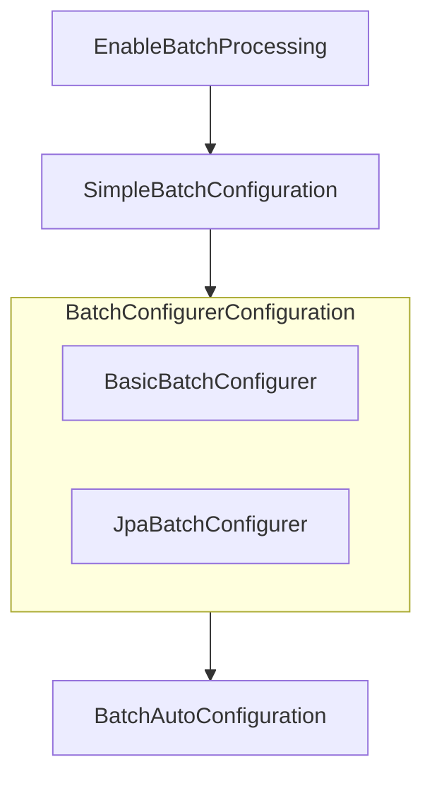

키워드:: [[SpringBatch]]

프로젝트는 Spring Batch Starter만 의존성과 DB 아무거나 추가하고 시작하면 된다.

## 스프링 배치 활성화

### @EnableBatchProcessing

```java
@EnableBatchProcessing // 스프링 배치 활성화
@SpringBootApplication  
public class SpringBatchApplication {  
  
    public static void main(String[] args) {  
       SpringApplication.run(SpringBatchApplication.class, args);  
    }  
  
}
```

- 총 4개의 `초기화 설정 클래스`를 실행
- 스프링 배치의 모든 초기화 및 실행 구성
- 빈으로 등록된 모든 Job을 검색해서 초기화 및 Job을 수행하도록 구성

### 초기화 설정 클래스



- @EnableBatchProcessing
- SimpleBatchConfiguration: 
    - JobBuilderFactory와 StepBuilderFactory 생성
    - 스프링 배치 주요 구성 요소를 `프록시 객체`로 생성
- BatchConfigurerConfiguration
    - BasicBatchConfigurer: `SimpleBatchConfiguration`이 생성한 프록시의 실제 객체 생성
    - JpaBatchConfigurer: Jpa 관련 객체를 생성
- BatchAutoConfiguration:
    - 스프링 배치가 초기화 될 때 자동으로 실행되는 설정 클래스
    - Job을 수행하는 `JobLauncherApplicationRunner` 빈을 생성

`@EnableBatchProcessing` 클래스를 따라가보면 `BatchConfiguartionSelector.class`를 import 하는데, 이 클래스의 코드를 보면 'modular'가 아니면 `SimpleBatchConfiguration`를 생성하도록 되어 있다.